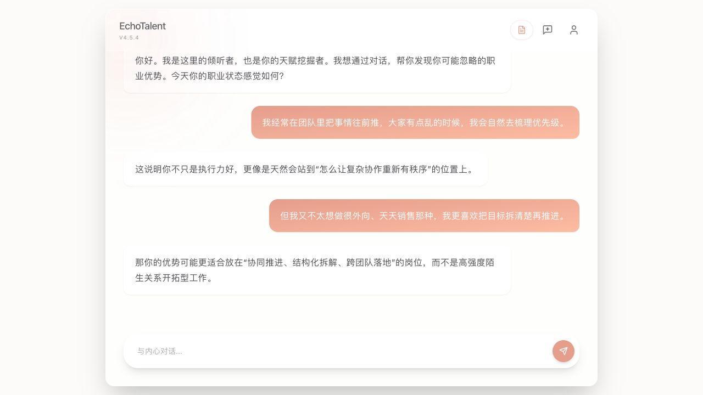
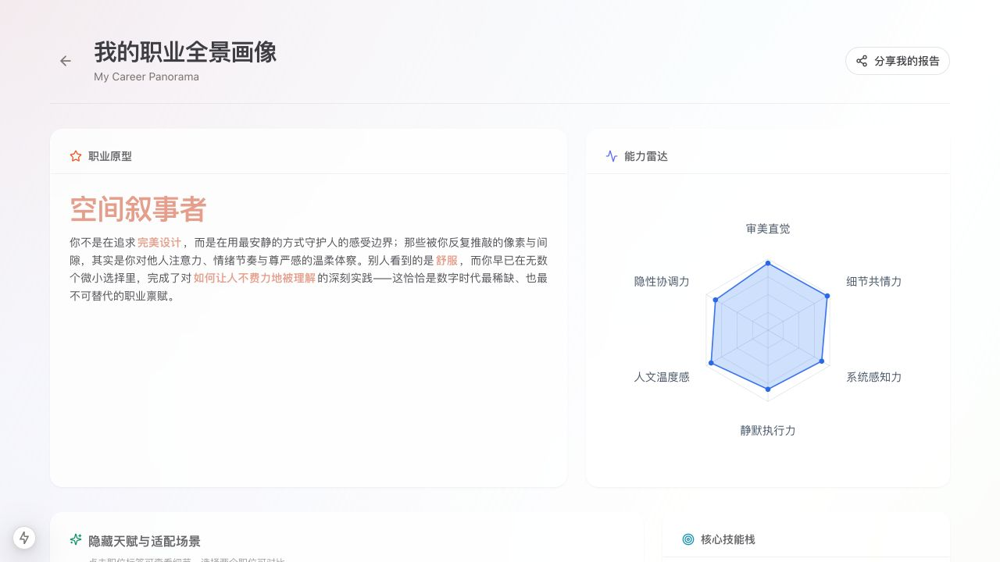
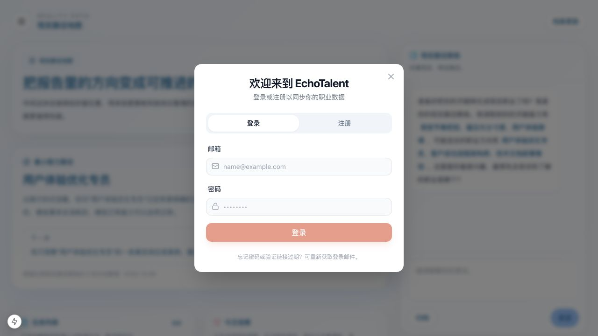

# EchoTalent · 天赋回声

> 从一次真诚的对话开始，理解你的职业优势，并把它转化为可以验证的现实路径。

当前版本：**v4.5.5**

官网：[echotalent.fun](https://echotalent.fun)

## 项目介绍

EchoTalent 是一个 AI 职业探索产品。它不只给出一份静态测评结果，而是通过对话帮助用户梳理经历、兴趣、能力和工作偏好，生成结构化职业报告，再把报告延伸为现实岗位、验证问题、准备重点和行动线索。

产品的核心闭环是：

```text
真实对话 → 职业报告 → 路径预览 → 邮箱注册/登录 → 保存个人资料与报告 → 现实路径地图
```

## 主要功能

### 1. AI 职业探索对话

- 通过自然对话识别用户的优势、动机、经验和工作偏好。
- 支持继续追问、新对话和报告入口管理。
- 对话内容优先保持完整、清晰和有上下文，不把功能指令误当成职业素材。

### 2. 结构化职业报告

- 输出职业画像、核心能力、优势描述、推荐方向和下一步思考。
- 支持岗位方向详情、职业对比和报告分享图。
- 报告生成优先保证内容质量，异常时提供有限的安全兜底。

### 3. 现实路径地图 `/path`

- 将报告中的方向翻译为现实岗位和可验证的工作场景。
- 展示岗位日常、常见要求、能力证据、资源、经验和待验证问题。
- 通过现实路径教练继续讨论岗位、JD、准备度和行动选择。
- 新版 `/path` 是当前唯一的现实路径地图入口，旧的 `/coach/path` 不再作为产品入口。

现实路径的产品原则不是“补足短处”，而是“能力迁移”。产品默认相信用户已经拥有重要的能力和资源，只是这些能力可能曾经以另一种岗位形式出现，或者还没有被目标岗位的语言表达出来。现实路径教练承担翻译器的角色：看见用户过去反复使用的优势，翻译成目标岗位的工作动作，判断可以迁移到哪些场景，再帮助用户用一个低阻力入口把已有能力调用起来。教练的作用是启发和引导用户发现可能性，而不是灌输“你需要做什么”；当用户真正看见自己的可能性后，下一步往往会自然浮现。任务列表承接的是用户自己形成的下一步意图，教练可以扩展信息渠道、获取方式和观察角度，但不替用户派单或默认写入。需要补充的不是一长串课程和任务，而是让已有能力被目标岗位看见、验证和使用的最小证据。
能力验证要快速收束：围绕一个岗位先锁定最值得关注的 3–5 个核心能力，每个能力寻找一条已证实的工作经验、交付物或行为证据，重点看用户做过什么、解决了什么、做成了什么。用户给出具体证据后，教练必须立即整理“证据—能力—岗位动作”，停下来让用户确认这条判断是否准确；确认后再进入下一个能力。能力证据确认和左侧资料板批量更新是两个独立节点，不能混为一谈。工具、框架、技术和软件属于后期岗位语境核对项：方向探索早期不让它们抢占能力映射，用户确认具体迁移方向后再了解常见工具；工具默认可替代，不等于能力缺口。

### 4. 邮箱注册与资料同步

- 使用 Supabase Auth 和 Resend 完成邮箱注册、验证邮件和登录。
- 验证后保存用户显示名、头像、协议版本和训练授权。
- 登录后自动保存对话、消息、职业报告、路径预览、人才画像和上下文资料。
- 未登录用户生成的报告会先保存为匿名草稿，注册或登录后自动认领。
- 报告认领采用事务和幂等设计，重复回跳不会产生重复资料。

### 5. 用户中心与数据沉淀

- 查看已保存的职业资料和路径内容。
- 支持会话持久化与 token 自动续期，刷新页面后保持登录状态。
- 用户可以管理个人资料，并在需要时删除账户。

## 建议使用流程

1. 打开 `/chat`，先用自然语言描述你的经历、兴趣、擅长的事情和当前困惑。
2. 根据 AI 的追问补充真实例子，尽量说明你做过什么、怎么做、结果如何。
3. 生成职业报告，查看职业画像、能力和推荐方向。
4. 点击“查看路径预览”，先浏览主选方向、备选方向和现实验证问题。
5. 如果希望进入完整的现实路径地图，在 `/path` 完成邮箱注册或登录。
6. 打开验证邮件并完成回跳，系统会自动保存用户资料并认领刚刚生成的报告。
7. 在路径地图中继续与现实路径教练对话，核对岗位日常、能力证据、资源和下一步行动。

## 产品示例

以下截图来自本地演示数据，用于展示主要使用步骤，不包含真实用户信息。

### 对话探索



### 职业报告



### 现实路径地图



## 最新版本 · v4.5.5

### Auth & Career Path

- 完成 Resend + Supabase 邮箱注册、验证邮件、登录和回跳链路。
- 修复登录后先初始化用户资料、再进入路径地图的流程顺序。
- 新增匿名报告草稿保存和注册后自动认领。
- 新增报告认领事务、过期校验、冲突保护和幂等处理。
- 登录后保存对话、消息、路径预览、人才画像和用户上下文。
- 统一 `package.json`、`package-lock.json`、README、CHANGELOG 和 `/chat` 版本角标。
- 增加本地预览脚本，启动时清理旧 Next.js 进程和缓存，并检查 CSS 是否正常加载。

### 运营数据与周报

- `/admin` 已支持查看 PV、UV、页面停留、访问来源、漏斗、消息量和关键事件。
- `GET /api/admin/weekly-report` 返回最近 7 天的聚合周报；管理员访问需要现有管理员鉴权。
- Vercel Cron 每周一 09:00（北京时间）触发周报、每月 1 日 09:00（北京时间）触发上月月报发送。需要配置 `CRON_SECRET`、`RESEND_API_KEY`、`ANALYTICS_REPORT_FROM_EMAIL` 和 `ANALYTICS_REPORT_TO_EMAIL`。
- 周报只发送聚合指标，不发送用户原始对话、邮箱地址或 IP。
- 周报/月报会按 User-Agent 聚合访问城市、设备类别、可公开的设备型号和操作系统；iPhone/iPad 及多数电脑不会公开具体硬件型号，会标记为“具体型号未公开”。
- 匿名访客通过本地访客 ID 识别回访；一次匿名会话在连续 6 小时无活动后才切分，适配低频职业探索场景。
- `/admin` 及其数据接口仅允许 `localhost`、`127.0.0.1` 或 `::1` 访问；本机管理员码验证后使用签名 Cookie 免重复输入。周报定时接口仅接受 `CRON_SECRET` 调用。
- 登录弹窗支持发送密码重置邮件，邮件链接进入 `/auth/reset` 设置新密码；链接失效时需重新发送。

## 技术栈

- Next.js 15 App Router
- TypeScript
- Tailwind CSS
- Supabase Auth、Postgres 和 REST/RPC
- Resend SMTP via Supabase Auth
- Vercel AI SDK
- 阿里云 DashScope / Qwen
